# Data Model View

TimeGrapherNet은 별도 데이터베이스를 사용하지 않는다. 따라서 전통적인 persisted domain element는 WAV 파일이며, 나머지는 실행 중 생성·전달·렌더링되는 도메인 데이터 구조다. 이 다이어그램은 프로젝트가 조작하는 주요 데이터 엔티티와 1:1, 1:n, 집합/집약, 일반화/특수화 관계를 함께 보여준다.

```mermaid
classDiagram
direction TB

class AnalysisRun {
    +ulong SessionId
    +RunMode Mode
}

class AnalysisRunSettings {
    +int SampleRate
    +double LiftAngle
    +int AveragingPeriod
    +bool UseCOnset
    +bool AutoBph
    +int ManualBph
    +double HpfCutoffHz
    +int SoundImageWidth
    +int SoundImageHeight
    +int ScopeSnapshotPointBudget
}

class AudioSource {
    <<abstract>>
    +string SourceKind
}

class LiveAudioSource {
    +double Gain
}

class PlaybackSource {
    +string FilePath
}

class SimSource {
    +double Bph
    +double RateError
    +double BeatError
}

class LiveAudioDevice {
    +int Number
    +string Name
}

class WatchSynthStreamConfig {
    +uint SampleRateHz
    +double Bph
    +double RateErrorSPerDay
    +double BeatErrorMs
    +double WatchAmplitudeDegrees
}

class WavFile {
    +string Path
    +bytes RIFF_WAVE_Data
}

class WavFormatInfo {
    +ushort AudioFormat
    +ushort NumChannels
    +int SampleRate
    +uint ByteRate
    +ushort BlockAlign
    +ushort BitsPerSample
    +long DataOffset
    +uint DataSize
}

class WavData {
    +int SampleRate
    +float[] Samples
}

class MasterAudioBuffer {
    +int Channels
    +int SecondsOfBuffer
    +float[] Samples
    +ulong TotalSamplesWritten
    +double Fps
    +double Spf
    +double Sps
}

class AnalysisFrame {
    +ulong SessionId
    +ulong SourceId
    +int SampleRate
    +bool InputOverrun
    +ulong InputSamplesDropped
    +ulong PendingSamples
    +ulong AnalysisLagSamples
    +double ProcessingElapsedMs
    +int DeadlineDegradationLevel
    +long CaptureTimestamp
    +bool CaptureTimestampIsLowerBound
    +long ProcessingCompletedTimestamp
    +ulong MissedBeats
    +uint SyncLossCount
    +bool BeatSynced
    +ulong GraphTickEnd
    +bool SoundImageUpdated
    +bool SpectrogramImageUpdated
    +double BackgroundFps
    +double BackgroundSps
    +double BackgroundSpf
    +double ForegroundFps
    +double ForegroundSps
    +double ForegroundSpf
    +bool ForegroundStatsUpdated
}

class GraphSeriesFrame {
    +string Id
    +IReadOnlyList~double~ X
    +IReadOnlyList~double~ Y
    +bool Replace
}

class ScopeVerticalMarker {
    +double X
    +double Height
    +uint Color
}

class ScopeHorizontalMarker {
    +HorizontalMarkerDirection Direction
    +double XLeft
    +double XRight
    +double Length
    +double Height
    +uint Color
}

class ScopeTextMarker {
    +double X
    +double Height
    +string Text
    +uint Color
    +MarkerTextAlignment Alignment
}

class WatchMetricsUpdate {
    +bool TicRateUpdated
    +bool TocRateUpdated
    +IReadOnlyList~double~ XTic
    +IReadOnlyList~double~ YTic
    +IReadOnlyList~double~ XToc
    +IReadOnlyList~double~ YToc
    +bool ResultsUpdated
    +string ResultsText
    +string CMarkerText
    +bool BeatTimingSampleUpdated
    +BeatTimingSample BeatTimingSample
    +bool AmplitudeSampleUpdated
    +AmplitudeSample AmplitudeSample
    +bool DerivedMeasuresUpdated
    +DerivedTimingMeasures DerivedMeasures
}

class BeatTimingSample {
    +ulong BeatNumber
    +double TimeS
    +bool IsTic
    +double RateErrorMs
    +bool RateValid
    +double RateSPerDay
    +bool BeatErrorValid
    +double BeatErrorSignedMs
    +int Bph
}

class AmplitudeSample {
    +double TimeS
    +bool InstantValid
    +double InstantDeg
    +bool PairAverageUpdated
    +double PairAverageDeg
}

class DerivedTimingMeasures {
    +bool DiffTicTacValid
    +double DiffTicTacMs
    +bool DiffPeriodValid
    +double DiffPeriodMs
    +bool AvgPeriodValid
    +double AvgPeriodMs
}

class BeatMetricsHistorySnapshot {
    +ulong Version
    +MetricsHistorySeries Rate
    +MetricsHistorySeries Amplitude
    +MetricsHistorySeries BeatError
    +DerivedTimingMeasures Derived
    +StatsSummary RateStats
    +StatsSummary AmplitudeStats
    +bool RateValid
    +double RateSPerDay
    +int Bph
    +bool AmplitudeValid
    +double AmplitudeDeg
    +bool BeatErrorValid
    +double BeatErrorSignedMs
    +double LatestTimeS
    +WatchPosition ActivePosition
    +IReadOnlyList~PositionSummary~ Positions
}

class WatchPosition {
    <<enumeration>>
    CH
    CB
    P6H
    P9H
    P3H
    P12H
    P6H45
    P9H45
    P3H45
    P12H45
}

class PositionSummary {
    +WatchPosition Position
    +StatsSummary Rate
    +StatsSummary Amplitude
    +StatsSummary BeatError
}

class StatsSummary {
    +bool Valid
    +double Min
    +double Max
    +double Mean
    +double Sigma
    +long Count
}

class MetricsHistorySeries {
    +IReadOnlyList~double~ X
    +IReadOnlyList~double~ Y
    +IReadOnlyList~double~ YMin
    +IReadOnlyList~double~ YMax
}

class BeatSegmentsSnapshot {
    +ulong Version
    +IReadOnlyList~BeatSegment~ Segments
    +double LiftAngleDeg
    +BeatNoiseAverageSnapshot Average
}

class BeatSegment {
    +ReadOnlyMemory~float~ Samples
    +double MsPerPoint
    +double StartTimeS
    +bool IsTic
    +double AOffsetMs
    +float PeakValue
    +bool CPeakValid
    +double CPeakOffsetMs
    +bool COnsetValid
    +double COnsetOffsetMs
}

class BeatNoiseAverageSnapshot {
    +bool SigmaEnabled
    +bool Frozen
    +int IntervalsPerLane
    +double MsPerPoint
    +int Lane1Count
    +int Lane2Count
    +IReadOnlyList~float~ Lane1
    +IReadOnlyList~float~ Lane2
    +double Lane1MeanPeak
    +double Lane2MeanPeak
}

class PixelBuffer {
    +int Width
    +int Height
    +uint[] Pixels
}

class TgConfig {
    +double SampleRate
    +TgBphMode BphMode
    +int ManualBph
    +double HpfCutoffHz
    +double EnvelopeSmoothMs
    +double EventMinSeparationMs
    +double SyncTolerancePct
    +double AutoDetectSeconds
    +int SyncLossMisses
    +double PllPeriodGain
    +double PllAcGain
    +double OnsetFractionInit
    +double MinPeakFractionInit
    +bool SuppressPreSyncEvents
    +TgCPlacement CPlacement
}

class TgResult {
    +TgSyncStatus SyncStatus
    +int DetectedBph
    +double MeasuredPeriodS
    +List~TgEvent~ Events
    +float[] ProcessedPcm
    +int ProcessedPcmLen
    +ulong ProcessedPcmStartSample
    +bool SyncLostEvent
    +bool SyncAcquiredEvent
    +bool DetectorResetEvent
    +float OnsetThreshold
    +float MinPeakThreshold
    +float NoiseFloor
    +float ReferencePeak
}

class TgEvent {
    +double TimeSeconds
    +ulong SampleIndex
    +double SubSampleOffset
    +float PeakValue
    +TgEventType Type
    +bool IsPreSync
    +ulong OnsetSampleIndex
    +double OnsetSubSampleOffset
    +double OnsetTimeSeconds
    +bool OnsetValid
}

AudioSource <|-- LiveAudioSource
AudioSource <|-- PlaybackSource
AudioSource <|-- SimSource

AnalysisRun "1" *-- "1" AnalysisRunSettings : configured by
AnalysisRun "1" *-- "1" AudioSource : selects
AnalysisRun "1" *-- "1" MasterAudioBuffer : owns
AnalysisRun "1" o-- "0..*" AnalysisFrame : produces

LiveAudioSource "1" --> "1" LiveAudioDevice : captures from
PlaybackSource "1" --> "1" WavFile : reads
SimSource "1" *-- "1" WatchSynthStreamConfig : uses

WavFile "1" *-- "1" WavFormatInfo : contains format
WavFile "1" --> "0..1" WavData : decoded as
WavData "1" --> "0..*" MasterAudioBuffer : supplies samples to
MasterAudioBuffer "1" --> "0..*" TgResult : analyzed into

TgConfig "1" --> "0..*" TgResult : configures detection
TgResult "1" *-- "0..*" TgEvent : contains

AnalysisFrame "1" *-- "0..*" GraphSeriesFrame : contains scope/rate series
AnalysisFrame "1" *-- "0..*" ScopeVerticalMarker : contains vertical markers
AnalysisFrame "1" *-- "0..*" ScopeHorizontalMarker : contains horizontal markers
AnalysisFrame "1" *-- "0..*" ScopeTextMarker : contains text markers
AnalysisFrame "1" *-- "1" WatchMetricsUpdate : contains metrics
AnalysisFrame "1" o-- "0..1" PixelBuffer : contains sound image
AnalysisFrame "1" o-- "0..1" PixelBuffer : contains spectrogram image
AnalysisFrame "1" o-- "0..1" BeatMetricsHistorySnapshot : shares cumulative history
AnalysisFrame "1" o-- "0..1" BeatSegmentsSnapshot : shares recent beat windows

WatchMetricsUpdate "1" o-- "0..1" BeatTimingSample : per A event
WatchMetricsUpdate "1" o-- "0..1" AmplitudeSample : per C event
WatchMetricsUpdate "1" o-- "0..1" DerivedTimingMeasures : per A event
BeatMetricsHistorySnapshot "1" *-- "3" MetricsHistorySeries : rate/amplitude/beat error
BeatMetricsHistorySnapshot "1" *-- "2" StatsSummary : running stability stats
BeatMetricsHistorySnapshot "1" --> "1" WatchPosition : tags new beats as
BeatMetricsHistorySnapshot "1" *-- "0..10" PositionSummary : measured positions only
PositionSummary "1" --> "1" WatchPosition : aggregates
PositionSummary "1" *-- "3" StatsSummary : rate/amplitude/beat error
BeatSegmentsSnapshot "1" o-- "0..8" BeatSegment : recent beats, oldest first
BeatSegmentsSnapshot "1" *-- "1" BeatNoiseAverageSnapshot : scope 2 lane state
```

## Entity summary

| Entity | Source in project | Meaning |
|---|---|---|
| `WavFile`, `WavFormatInfo`, `WavData` | `Core.AudioIo` | Persisted or decoded audio data used for playback, recording, and verification |
| `AnalysisRunSettings` | `TimeGrapher.App` | User-selected run parameters converted into `AnalysisWorker.Config`: sample rate, lift angle, averaging period, C-onset mode, BPH mode, HPF cutoff, sound-print image dimensions, scope snapshot point budget, and the PLL-event-veto flag. GUI runs always apply `TgDetectorOptions.Robust()` (adaptive floor + regime guard, measured regression-free); the veto flag additionally wires `PllMatchGate` |
| `TgDetectorOptions`, `BeatCandidate`, `BeatEventGateConfig` | `Core.Detection`, `Core.Detection.Scoring`, `Core.Analysis` | Opt-in robustness knobs (all defaults off = bit-identical port), the candidate-event context handed to an `IBeatEventGate` (event, sync state, thresholds, PLL match verdict captured at emission time), and the engine-level gate configuration carrier |
| `AudioSource` specializations | App run modes and Core workers | Live microphone, WAV playback, or synthetic signal input |
| `MasterAudioBuffer` | `Core.Shared` | Shared mono float ring buffer between input workers and analysis, with input throughput counters and capture timestamp lookup for latency reporting |
| `TgConfig`, `TgResult`, `TgEvent` | `Core.Detection` | Detector configuration, sync state, processed PCM, one-call event list, sync edge flags, detector thresholds, and typed A/C events distinguished by `TgEvent.Type` plus C-onset metadata |
| `AnalysisFrame` | `Core.Shared` | One UI update payload produced by an analysis pass, including source position, backlog/deadline state, latency timestamps, sync counters, graph tick, current beat-sync state, optional image payloads, and cumulative snapshots |
| `GraphSeriesFrame`, `ScopeVerticalMarker`, `ScopeHorizontalMarker`, `ScopeTextMarker`, `WatchMetricsUpdate`, `PixelBuffer` | `Core.Shared` | Data displayed as scope/rate graphs, marker DTOs, numeric results, and the sound-print / spectrogram images. The spectrogram payload (`AnalysisFrame.SpectrogramImage`) is the STFT of the recent 10 s input window built by `Core.Analysis.SpectrogramFrameProjector` — x = time, y = frequency (bins 0..~12 kHz, low at the bottom), color = dB magnitude through the 64-entry inferno-like LUT — published from a fixed three-buffer pool on the sound-print cadence |
| `BeatTimingSample`, `AmplitudeSample`, `DerivedTimingMeasures` | `Core.Shared` | Machine-readable per-beat values (rate error, validity flags, signed beat error, locked BPH, amplitude, pair-average update flag, DiffTicTac/DiffPeriod/AvgPeriod) emitted per A/C event |
| `BeatMetricsHistorySnapshot`, `MetricsHistorySeries` | `Core.Shared` (built by `Core.Metrics.BeatMetricsHistory`) | Immutable cumulative history of rate/amplitude/beat-error series plus validity-guarded latest readings, running stats, active position, and locked BPH, shared across frames; survives latest-wins frame coalescing |
| `StatsSummary` | `Core.Shared` (fed by `Core.Metrics.RunningStats`) | Running min/max/mean/population-σ since start for rate and amplitude — exact per-beat statistics independent of series decimation (Vario display) |
| `WatchPosition` | `Core.Shared` | Standard watch test positions per NIHS 95-10 / ISO 3158 (CH dial up, CB dial down, 6H crown left, 9H crown down, 3H crown up, 12H crown right), plus four 45° intermediate positions (P6H45/P9H45/P3H45/P12H45) for the 10-step sequence; stamped on every snapshot as the position new beats are tagged with |
| `PositionSummary` | `Core.Shared` (aggregated by `Core.Metrics.BeatMetricsHistory`) | Per-position rate/amplitude/signed-beat-error running aggregates; only measured positions appear, bounded by the 10-position catalog (WatchPositions.Count; Positions display) |
| `BeatSegmentsSnapshot`, `BeatSegment` | `Core.Shared` (built by `Core.Analysis.BeatSegmentCapture`) | Ring of the last 8 per-beat envelope windows (5 ms pre-roll, 400 ms, 1600 points) with A / C-peak / C-onset offsets, phase and lift angle; segment samples reference the capture's fixed 28-buffer pool and stay immutable while referenced by the completed ring or the two most recently built snapshots — publication-gated reuse (Beat-Noise Scope; reused by beat-aligned waveform views) |
| `BeatNoiseAverageSnapshot` | `Core.Shared` (built by `Core.Analysis.BeatNoiseAverager`) | Scope 2 state: two phase-alternating 20 ms averaged lanes (800 points each) deliberately labeled trace 1/2 — never tic/toc — with per-lane interval counts, intervals-per-lane target, ms-per-point scale, mean peak amplitude and the cycle freeze flag |

## Relationship notes

| Relationship type | Representation in this project |
|---|---|
| 1:1 | One `AnalysisRun` has one `AnalysisRunSettings`, one selected `AudioSource`, and one `MasterAudioBuffer` |
| 1:n | One `AnalysisRun` produces many `AnalysisFrame` objects; one `TgResult` contains many `TgEvent` objects; one `AnalysisFrame` contains many graph series and marker DTOs |
| Pre/post-gate event streams | When an event gate is configured, `DetectorResultSnapshot.Events` keeps the PRE-gate raw detector stream (display surfaces see every event) while the per-event updates list carries only the POST-gate stream that reached `WatchMetrics`; `DetectorResultSnapshot.VetoedEvents` counts the dropped events (including pair-vetoed Cs) |
| n:n | No native persisted many-to-many relationship exists because the app has no database and most runtime data is owned by a single run/frame |
| Generalization / specialization | `AudioSource` specializes into live/playback/sim sources; detector events are one `TgEvent` DTO distinguished by `TgEvent.Type`; marker payloads are three separate DTOs (`ScopeVerticalMarker`, `ScopeHorizontalMarker`, `ScopeTextMarker`) rather than subclasses of a shared marker type |
| Aggregation / composition | `AnalysisFrame` is composed from graph series, marker DTOs, metrics, and the optional sound-print / spectrogram images (each a `PixelBuffer` from its projector's fixed publish pool); `WavFile` contains format metadata and can be decoded into `WavData`; `BeatMetricsHistorySnapshot` aggregates three `MetricsHistorySeries` plus up to ten `PositionSummary` rows (WatchPositions.Count) and is shared (aggregation, not owned) by many frames; `BeatSegmentsSnapshot` is shared the same way and aggregates (not owns) up to eight `BeatSegment` windows whose samples live in the capture's pooled buffers |
