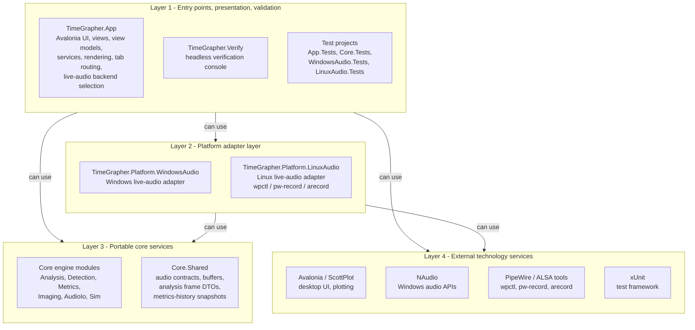

# Layered View

이 문서는 TimeGrapherNet의 모듈을 논리적 layer로 묶고, 각 layer가 어떤 아래 layer를 사용할 수 있는지 보여준다. 화살표 `A --> B`는 `A` layer가 `B` layer를 사용할 수 있다는 뜻이며, 허용 사용 방향은 위에서 아래로만 흐른다.

이 프로젝트는 인접 layer만 사용할 수 있는 strict layering이 아니라, 위 layer가 필요한 아래 layer를 직접 사용할 수 있는 relaxed layering으로 정리한다. 단, 아래 layer가 위 layer를 사용하는 역방향 의존은 허용하지 않는다.

## Allowed-to-use layers

## Layer responsibilities

| Layer | Modules | Cohesive service offered |
|---|---|---|
| Layer 1 - Entry points, presentation, validation | `TimeGrapher.App`, `TimeGrapher.Verify`, `*.Tests` | User interaction, tab/frame routing, live-audio backend selection, headless verification, and regression validation |
| Layer 2 - Platform adapter layer | `TimeGrapher.Platform.WindowsAudio`, `TimeGrapher.Platform.LinuxAudio` | OS-specific live-audio input behind Core audio contracts |
| Layer 3 - Portable core services | `TimeGrapher.Core` submodules | UI/OS-independent watch sound analysis, WAV I/O, simulation, metrics, shared frame DTOs, and audio contracts |
| Layer 4 - External technology services | Avalonia, ScottPlot, NAudio, PipeWire/ALSA tools, xUnit | Framework, OS, plotting, audio, and testing capabilities supplied from outside the project |

## Allowed dependency rules

| Rule | Meaning in this project |
|---|---|
| Layer 1 can use Layer 2 | `TimeGrapher.App` conditionally references Windows or Linux live-audio adapters through `RuntimeIdentifier`/compile constants; the WindowsAudio/LinuxAudio test projects validate their platform adapters |
| Layer 1 can use Layer 3 | The UI and verification console can call Core analysis, WAV, simulation, detection, and shared DTO modules such as `AnalysisFrame` and `BeatMetricsHistorySnapshot` |
| Layer 1 can use Layer 4 | UI code can use Avalonia and ScottPlot; tests can use xUnit |
| Layer 2 can use Layer 3 | Platform adapters implement Core live-audio contracts from `Core.Shared` |
| Layer 2 can use Layer 4 | The Windows adapter calls NAudio; the Linux adapter launches PipeWire/ALSA command-line tools (`wpctl`, `pw-record`, `arecord`) |

## Constraints

| Constraint | Rationale |
|---|---|
| No lower-to-upper dependency | `TimeGrapher.Core` must not reference App or Platform projects, keeping analysis portable and testable |
| Platform-specific code is isolated | Windows and Linux audio capture implementations stay in platform adapter projects; App selects them through `LiveAudioBackend` instead of mixing capture details into Core |
| UI technology stays above Core | Avalonia and ScottPlot are used by the app layer, not by the portable analysis engine |
| Test modules sit at the top | Tests can use runtime modules, but runtime modules must not depend on tests |
