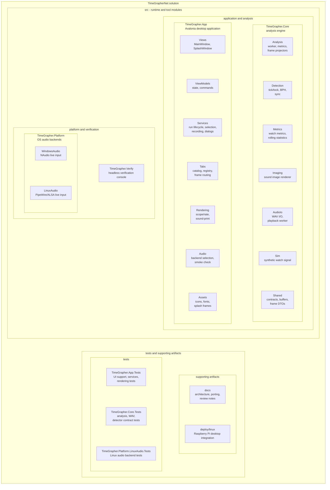

# Module Decomposition View

이 문서는 TimeGrapherNet 솔루션을 모듈 분해 관점에서 보여준다. 외곽 상자는 상위 모듈이고, 그 안에 배치된 상자들은 해당 모듈에 포함되는 하위 모듈이다.

## Decomposition diagram

## Module summary

| Module | Submodules / parts | Role |
|---|---|---|
| `TimeGrapher.App` | `Views`, `ViewModels`, `Services`, `Tabs`, `Rendering`, `Audio`, `Assets` | Avalonia UI, run lifecycle coordination, graph/sound-print rendering, platform audio backend selection |
| `TimeGrapher.Core` | `Analysis`, `Detection`, `Metrics`, `Imaging`, `AudioIo`, `Sim`, `Shared` | UI/OS-independent watch sound analysis engine and shared contracts |
| `TimeGrapher.Platform` | `TimeGrapher.Platform.WindowsAudio`, `TimeGrapher.Platform.LinuxAudio` | OS-specific live microphone input implementations behind Core live-audio contracts |
| `TimeGrapher.Verify` | console entry point | Headless WAV/generated-signal verification tool |
| `tests` | `TimeGrapher.App.Tests`, `TimeGrapher.Core.Tests`, `TimeGrapher.Platform.LinuxAudio.Tests` | Regression tests for UI support services, analysis contracts, and Linux audio behavior |
