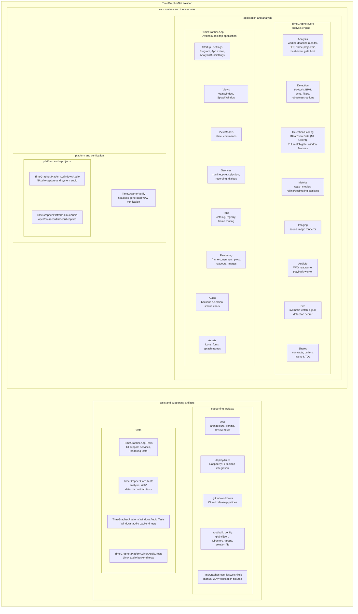

# Module Decomposition View

이 문서는 TimeGrapherNet 솔루션을 모듈 분해 관점에서 보여준다. 외곽 상자는 상위 모듈이고, 그 안에 배치된 상자들은 해당 모듈에 포함되는 하위 모듈이다.

## Decomposition diagram

## Module summary

| Module | Submodules / parts | Role |
|---|---|---|
| `TimeGrapher.App` | startup/settings files, `Views`, `ViewModels`, `Services`, `Tabs`, `Rendering`, `Audio`, `Assets` | Avalonia UI, run lifecycle coordination, tab frame routing/rendering, platform audio backend selection |
| `TimeGrapher.Core` | `Analysis`, `Detection`, `Detection/Scoring`, `Metrics`, `Imaging`, `AudioIo`, `Sim`, `Shared` | UI/OS-independent watch sound analysis engine and shared contracts. `Detection/Scoring` declares the veto-only `IBeatEventGate` socket (classical `PllMatchGate` now, ONNX TinyML gate later via a leaf inference project) plus the `BeatWindowFeatures` feature contract; `Detection` includes the default adaptive floor, regime guard, and PLL-guided post-lock min-peak sensitivity behavior; `Analysis` hosts the gate at the metrics choke point; `Sim` adds the ground-truth `DetectionScorer` |
| `TimeGrapher.Platform.WindowsAudio` | `AudioCaptureWorker`, `SystemAudioControl` | Windows live microphone capture and system-volume integration behind Core live-audio contracts |
| `TimeGrapher.Platform.LinuxAudio` | `LinuxLiveAudioWorker` | Linux live microphone capture through PipeWire/ALSA command-line tools behind Core live-audio contracts |
| `TimeGrapher.Verify` | console entry point | Headless generated/WAV verification tool that exercises the Core detection and metrics pipeline |
| `tests` | `TimeGrapher.App.Tests`, `TimeGrapher.Core.Tests`, `TimeGrapher.Platform.WindowsAudio.Tests`, `TimeGrapher.Platform.LinuxAudio.Tests` | Regression tests for UI support/services/rendering/tabs, Core analysis contracts, and Windows/Linux audio behavior |
| supporting artifacts | `docs`, `deploy/linux`, `.github/workflows`, root build config, `TimeGrapherTestFilesWeishiMic` | Architecture/course documentation, Raspberry Pi deployment integration, CI/release automation, shared build metadata, and manual WAV fixtures |
