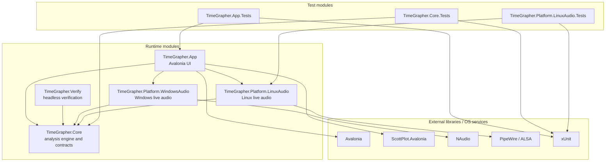
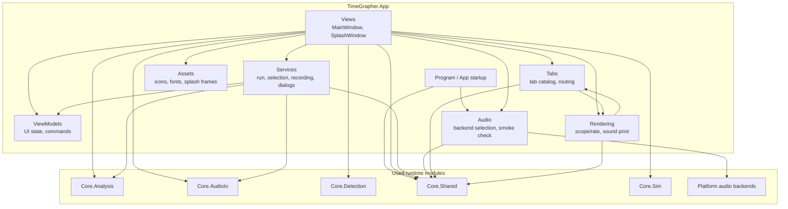
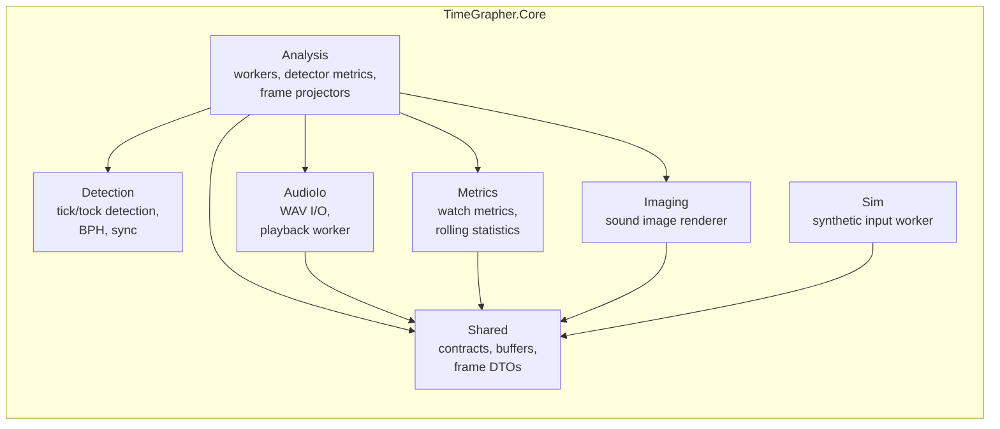

# Module Uses View

이 문서는 TimeGrapherNet의 모듈 사용 관계를 보여준다. 화살표 `A --> B`는 `A` 모듈이 `B` 모듈을 사용한다는 뜻이며, 이 관계가 모듈 간 결합을 만든다.

## Project-level uses

## App internal uses

## Core internal uses

## Coupling summary

| Using module | Used module(s) | Coupling created |
|---|---|---|
| `TimeGrapher.App` | `TimeGrapher.Core`, platform audio backends, Avalonia, ScottPlot | UI is coupled to Core contracts/results and to selected platform audio adapters |
| `TimeGrapher.Verify` | `TimeGrapher.Core` | Console verification shares the same analysis, detection, WAV, and simulator modules as the app |
| `TimeGrapher.Platform.WindowsAudio` | `TimeGrapher.Core.Shared`, NAudio | Windows input backend is coupled to Core live-audio contracts and NAudio APIs |
| `TimeGrapher.Platform.LinuxAudio` | `TimeGrapher.Core.Shared`, PipeWire/ALSA environment | Linux input backend is coupled to Core live-audio contracts and Linux audio facilities |
| `TimeGrapher.Core.Analysis` | `Detection`, `Metrics`, `Imaging`, `AudioIo`, `Shared` | Analysis coordinates the core algorithm modules and is the most coupled Core submodule |
| `*.Tests` | target runtime modules, xUnit | Tests depend on the modules they validate and on the xUnit test framework |
