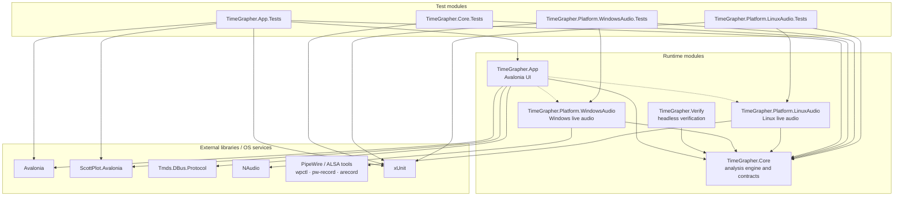
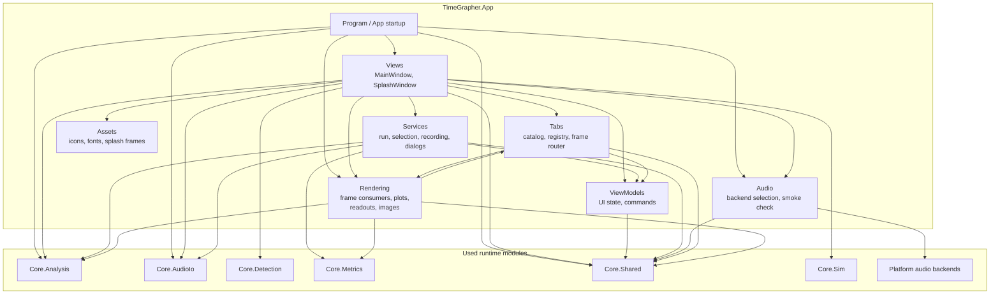
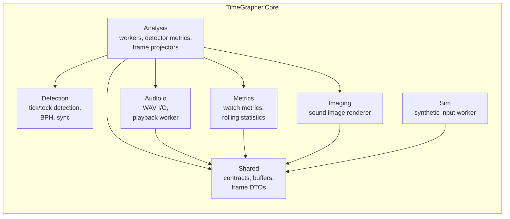

# Module Uses View

이 문서는 TimeGrapherNet의 모듈 사용 관계를 보여준다. 화살표 `A --> B`는 `A` 모듈이 `B` 모듈을 사용한다는 뜻이며, 이 관계가 모듈 간 결합을 만든다.

## Project-level uses

`TimeGrapher.App`의 플랫폼 오디오 `ProjectReference`는 `RuntimeIdentifier` 조건부다. RID가 없을 때는 개발/테스트 빌드를 위해 Windows와 Linux 어댑터가 모두 포함되고, `win-*` 또는 `linux-*` RID publish에서는 해당 플랫폼 어댑터만 포함된다.

## App internal uses

## Core internal uses

## Coupling summary

| Using module | Used module(s) | Coupling created |
|---|---|---|
| `TimeGrapher.App` | `TimeGrapher.Core`, RID-selected platform audio backends, Avalonia, ScottPlot, Tmds.DBus.Protocol | UI is coupled to Core contracts/results, desktop UI libraries, and selected platform audio adapters |
| `TimeGrapher.Verify` | `TimeGrapher.Core` | Console verification shares the same analysis, detection, WAV, and simulator modules as the app |
| `TimeGrapher.Platform.WindowsAudio` | `TimeGrapher.Core.Shared`, NAudio | Windows input backend is coupled to Core live-audio contracts and NAudio APIs |
| `TimeGrapher.Platform.LinuxAudio` | `TimeGrapher.Core.Shared`, `wpctl`, `pw-record`, `arecord` | Linux input backend is coupled to Core live-audio contracts and Linux audio command-line tools |
| `TimeGrapher.App.Tabs` | `TimeGrapher.App.Rendering`, `TimeGrapher.App.ViewModels`, `TimeGrapher.Core.Shared` | Tab registration owns tab-to-consumer wiring and reads view-model state for position controls |
| `TimeGrapher.App.Rendering` | `TimeGrapher.App.Tabs`, `TimeGrapher.Core.Analysis`, `TimeGrapher.Core.Metrics`, `TimeGrapher.Core.Shared` | Frame consumers implement tab routing contracts and render Core frame/metric DTOs |
| `TimeGrapher.Core.Analysis` | `Detection`, `Metrics`, `Imaging`, `AudioIo`, `Shared` | Analysis coordinates the core algorithm modules and is the most coupled Core submodule |
| `*.Tests` | target runtime modules, Core DTO namespaces, App UI libraries where control tests construct them, xUnit | Tests depend on the modules they validate, direct contract DTOs used by assertions, and the xUnit test framework |
