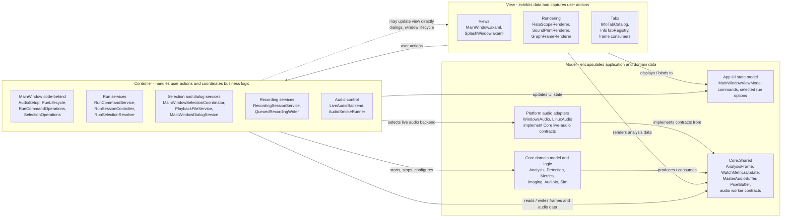

# Model-View-Controller View

이 문서는 TimeGrapherNet을 Model-View-Controller(MVC) 관점으로 해석해 보여준다. 실제 구현은 Avalonia의 바인딩과 `ViewModels`를 사용하는 실용적 MVVM/MVC 혼합 구조이지만, 사용자 입력 처리와 분석 상태 갱신 흐름은 MVC의 View, Controller, Model 역할로 나누어 설명할 수 있다.

## MVC role mapping

| MVC element | Project modules | Responsibility |
|---|---|---|
| Model | `TimeGrapher.Core.*`, `TimeGrapher.Core.Shared`, `MainWindowViewModel`, platform audio adapters | Holds analysis data, UI state, audio buffers, worker contracts, detection results, generated frames, and backend state |
| View | `TimeGrapher.App.Views`, `TimeGrapher.App.Rendering`, display-oriented `TimeGrapher.App.Tabs` types | Shows the current state as windows, controls, plots, sound-print images, and tab content; captures user gestures |
| Controller | `MainWindow` partial code-behind, `TimeGrapher.App.Services`, `TimeGrapher.App.Audio` | Handles button/menu actions, run lifecycle, file selection, recording, live audio selection, and analysis worker coordination |

## MVC constraints in this project

| Constraint | How the project satisfies it |
|---|---|
| View depends on Model | Views/renderers bind to `MainWindowViewModel` and render `AnalysisFrame`, `PixelBuffer`, graph series, and watch metric data from Core |
| View may depend on Controller | `MainWindow` user actions invoke command operations and services that start/stop runs, select files, and change tabs |
| Controller depends on Model | Controllers/services update the view model, configure Core analysis workers, control input workers, and consume analysis frames |
| Controller may depend on View | Dialog and window-lifecycle code interacts with `MainWindow` and Avalonia window objects |
| Model does not depend on View or Controller | `TimeGrapher.Core` has no reference to `TimeGrapher.App`; Core analysis and shared contracts are UI-independent |

## Notes

The strongest MVC boundary is around `TimeGrapher.Core`: it acts as the portable domain model and does not know about Avalonia views or app controllers. The app layer is more mixed because Avalonia code-behind, commands, and services coordinate user actions around a `MainWindowViewModel`, so this diagram documents the architectural roles rather than claiming a pure MVC framework implementation.
