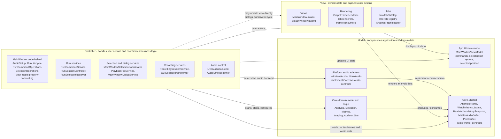

# Model-View-Controller View

이 문서는 TimeGrapherNet을 Model-View-Controller(MVC) 관점으로 해석해 보여준다. 실제 구현은 Avalonia의 바인딩과 `ViewModels`를 사용하는 실용적 MVVM/MVC 혼합 구조이지만, 사용자 입력 처리와 분석 상태 갱신 흐름은 MVC의 View, Controller, Model 역할로 나누어 설명할 수 있다.

## MVC role mapping

| MVC element | Project modules | Responsibility |
|---|---|---|
| Model | `TimeGrapher.Core.*`, `TimeGrapher.Core.Shared`, `MainWindowViewModel`, platform audio adapters | Holds analysis data, UI state, selected run options, selected watch position, audio buffers, worker contracts, detection results, generated frames, and backend state |
| View | `TimeGrapher.App.Views`, `TimeGrapher.App.Rendering`, display-oriented `TimeGrapher.App.Tabs` types | Shows the current state as windows, controls, plots, sound-print/spectrogram images, tab content, and per-position measurement tables; captures user gestures |
| Controller | `MainWindow` partial code-behind, `TimeGrapher.App.Services`, `TimeGrapher.App.Audio` | Handles button/menu actions, run lifecycle, file selection, recording, live audio selection, analysis worker coordination, and forwarding UI state changes to the running worker |

## Current tab routing

`InfoTabCatalog.All` is the source of truth for the analysis display tabs. The current catalog declares `Rate/Scope`, `Sound Print`, `Trace`, `Sweep`, `Vario`, `Beat Error`, `Filter Scope`, `Long-Term`, `Positions`, `Beat Noise`, `Escapement`, `Waveforms`, and `Spectrogram`.

`InfoTabRegistry.FromCatalog` builds one `TabItem` and one `IAnalysisFrameConsumer` per catalog definition. `GraphFrameRenderer` initializes/resets those consumers and owns the shared numeric results readout. During frame delivery, `AnalysisFrameRouter.Route` calls `ObserveFrame` on every consumer, then calls `RenderFrame` only on the active tab's consumer; `RenderToAll` is reserved for the pause-exit review-cursor clear path.

The `Positions` tab is a single tab (`InfoTabCatalog.TestPositionsTabId`, title `Positions`) even though it contains two view areas. `InfoTabRegistry.CreateTestPositionsRegistration` builds a left, one-column position selector and a right sequence-measurement table. Its `TestPositionsFrameConsumer` calls both `TestPositionsRenderer` and `MultiPositionSeqRenderer`, so the active-position highlight and the per-position measurement rows are rendered from the same `BeatMetricsHistorySnapshot`.

For position input, a button click updates `MainWindowViewModel.SelectedPositionIndex`; `MainWindow` observes that property change and forwards the selected `WatchPosition` through `RunSessionController.SetActivePosition` to the running `AnalysisWorker`. The `Reset Sequence` command follows the same MVC path: `MainWindowViewModel.ResetSequenceCommand` raises `ResetSequenceRequested`, `MainWindow.OnResetSequenceRequested` calls `RunSessionController.ResetPositionAggregates`, and Core clears only the per-position aggregates.

## MVC constraints in this project

| Constraint | How the project satisfies it |
|---|---|
| View depends on Model | Views/renderers bind to `MainWindowViewModel` and render `AnalysisFrame`, `BeatMetricsHistorySnapshot`, `BeatSegmentsSnapshot`, `PixelBuffer`, graph series, and watch metric data from Core |
| View may depend on Controller | `MainWindow` user actions invoke command operations and services that start/stop runs, select files, change tabs, and forward selected-position/reset-sequence actions |
| Controller depends on Model | Controllers/services update the view model, configure Core analysis workers, control input workers, forward position state, and consume analysis frames |
| Controller may depend on View | Dialog and window-lifecycle code interacts with `MainWindow` and Avalonia window objects |
| Model does not depend on View or Controller | `TimeGrapher.Core` has no reference to `TimeGrapher.App`; Core analysis and shared contracts are UI-independent |

## Notes

The strongest MVC boundary is around `TimeGrapher.Core`: it acts as the portable domain model and does not know about Avalonia views or app controllers. The app layer is more mixed because Avalonia code-behind, commands, and services coordinate user actions around a `MainWindowViewModel`, so this diagram documents the architectural roles rather than claiming a pure MVC framework implementation.
