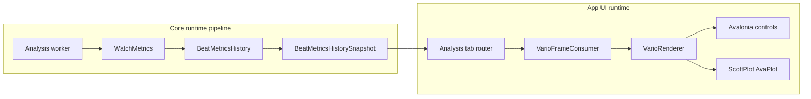
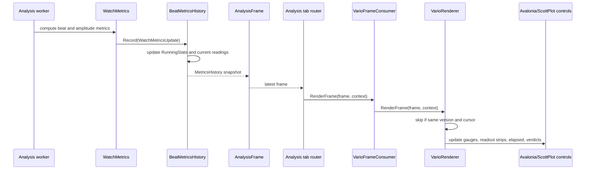

# Vario C&C View

이 문서는 Vario 기능을 Component-and-Connector 관점에서 보여준다. Module View가 정적 코드 분해를 설명한다면, C&C View는 실행 중 어떤 컴포넌트가 어떤 커넥터로 데이터를 주고받는지 설명한다.

## Runtime Components and Connectors

## Component Catalog

| Component | Runtime responsibility |
|---|---|
| Analysis worker | Produces analysis frames on the analysis side and includes the latest cumulative metrics history snapshot when available. |
| `WatchMetrics` | Converts detected beat/amplitude data into metric updates consumed by history. |
| `BeatMetricsHistory` | Records per-beat samples, updates Vario `RunningStats`, tracks current readings, and publishes immutable snapshots. |
| `BeatMetricsHistorySnapshot` | Runtime data packet shared by frames; Vario reads rate/amplitude stats, elapsed time, current values, and series for review cursor lookup. |
| Analysis tab router | Sends latest frames to registered tab consumers according to the app tab infrastructure. |
| `VarioFrameConsumer` | Receives generic frame callbacks and delegates render work to `VarioRenderer`. |
| `VarioRenderer` | Applies snapshot data to UI controls and plots. It skips repeated versions unless the review cursor changed. |
| Avalonia controls | Show status chips, elapsed time, criteria flyout content, and exact per-gauge readout-strip values. |
| ScottPlot `AvaPlot` controls | Show rate and amplitude gauges with acceptable band, min/max, average, current marker, and labels. |

## Connector Catalog

| Connector | Source -> Target | Data / call | Notes |
|---|---|---|---|
| Metric update call | Analysis worker -> `WatchMetrics` | detected beat/amplitude inputs | Produces the values that become rate, amplitude, beat error, and derived timing data. |
| History record call | `WatchMetrics` -> `BeatMetricsHistory` | `WatchMetricsUpdate` | Synchronous in Core; updates are folded into cumulative state. |
| Snapshot publication | `BeatMetricsHistory` -> frame | `BeatMetricsHistorySnapshot` reference | Snapshot is immutable and versioned; unchanged frames may share the same instance. |
| Frame dispatch | Analysis tab router -> `VarioFrameConsumer` | `AnalysisFrame`, `AnalysisTabRenderContext` | Vario uses `frame.MetricsHistory` and the optional review cursor time. |
| Render delegation | `VarioFrameConsumer` -> `VarioRenderer` | method call | Consumer has no additional accumulation responsibility. |
| UI mutation | `VarioRenderer` -> Avalonia / ScottPlot controls | text, brush, plot line/span updates | Occurs on the App rendering path and uses App-level UI libraries only. |

## Main Runtime Scenario

## Runtime Properties

| Property | Vario behavior |
|---|---|
| Data ownership | Core owns measurement accumulation; App owns presentation state. |
| Frame coalescing tolerance | Since Vario statistics are cumulative in Core, dropped UI frames do not drop beat samples from min/max/mean/sigma. |
| Long-run resource use | `RunningStats` keeps constant-size state for each measured value; plotted history uses the existing bounded/decimated history series. |
| Position handling | `BeatMetricsHistory.SetActivePosition` resets Vario rate/amplitude stats and elapsed baseline for the new position, while live series and position aggregates remain available. |
| Theme handling | `VarioFrameConsumer.ApplyTheme` forwards theme changes to `VarioRenderer`, which updates plot and label colors without changing Core data. |
| Review cursor behavior | When a review cursor is active, the renderer derives current rate/amplitude from the historical series at the cursor time instead of the newest live reading. |

## Architectural Constraints

| Constraint | Reason |
|---|---|
| Core must not depend on Avalonia, ScottPlot, or App rendering modules. | Keeps analysis portable across Windows and Raspberry Pi, and keeps headless verification possible. |
| Vario rendering must use `BeatMetricsHistorySnapshot` as the boundary object. | Maintains a single data contract shared by Trace, Long-Term, Positions, and Vario-style stability views. |
| UI-side Vario components must not re-accumulate per-beat statistics. | Prevents frame scheduling from changing measurement results and preserves deterministic statistics. |
| Threshold logic used in the criteria flyout and renderer must share the same constants. | Prevents documentation shown in the UI from drifting away from live verdict behavior. |
