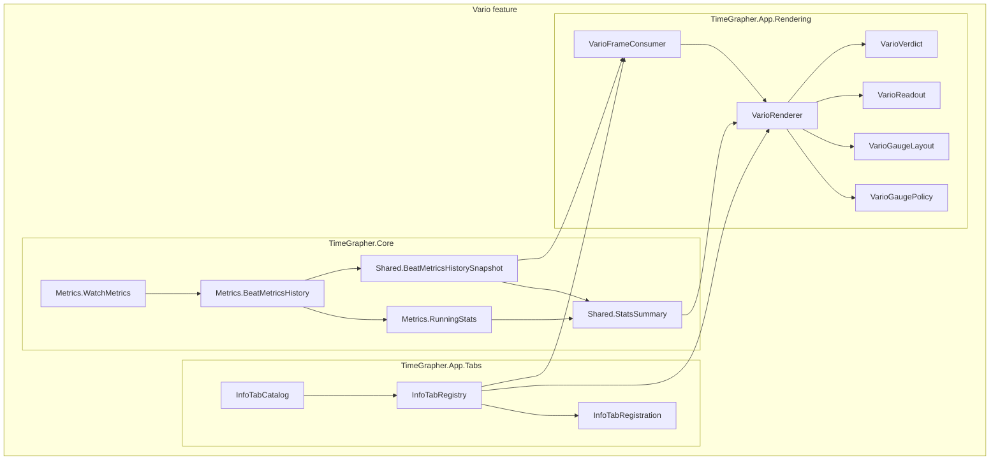
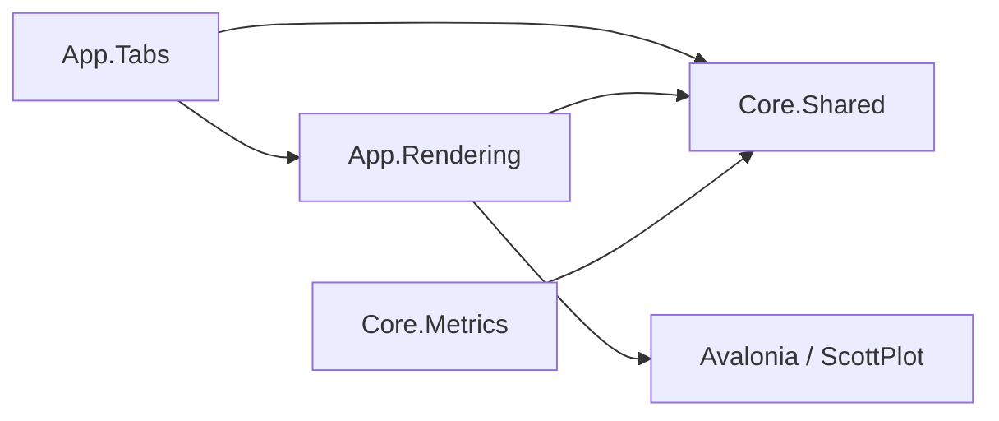

# Vario Module View

이 문서는 Vario 기능을 모듈 관점에서 보여준다. Vario는 장시간 측정 중 rate와 amplitude의 안정성을 보여주는 분석 탭이며, 구현은 Core의 누적 통계 생성 모듈과 App의 탭/렌더링 모듈로 나뉜다.

## Scope

Vario 기능의 책임은 다음 세 가지다.

1. Core에서 per-beat rate와 amplitude 값을 위치별 누적 통계로 축적한다.
2. 누적 통계와 현재값을 `BeatMetricsHistorySnapshot` 계약으로 App에 전달한다.
3. App에서 Vario 탭을 구성하고, 통계 표와 gauge, verdict를 렌더링한다.

## Decomposition Diagram

## Module Responsibilities

| Module | Responsibility in Vario |
|---|---|
| `TimeGrapher.Core.Metrics.BeatMetricsHistory` | Owns cumulative history, exact per-position Vario statistics, current readings, elapsed-time baseline, and snapshot publishing. |
| `TimeGrapher.Core.Metrics.RunningStats` | Maintains online min/max/mean/population sigma using constant memory, so long runs do not store every sample. |
| `TimeGrapher.Core.Shared.StatsSummary` | Carries the valid flag, min, max, mean, sigma, and sample count from Core to App. |
| `TimeGrapher.Core.Shared.BeatMetricsHistorySnapshot` | Publishes immutable cumulative history and Vario `RateStats`, `AmplitudeStats`, `StatsElapsedS`, and current readings. |
| `TimeGrapher.App.Tabs.InfoTabCatalog` | Declares the `Vario` tab id, name, refresh interval, and no graph-series contract because Vario reads the cumulative snapshot. |
| `TimeGrapher.App.Tabs.InfoTabRegistry` | Builds the Vario tab controls, criteria flyout, summary, gauge plots, numeric table, and `VarioFrameConsumer`. |
| `TimeGrapher.App.Rendering.VarioFrameConsumer` | Connects the generic analysis tab frame protocol to `VarioRenderer`. It accumulates no UI-side state. |
| `TimeGrapher.App.Rendering.VarioRenderer` | Renders rate/amplitude gauges, exact table values, elapsed time, and overall status from `BeatMetricsHistorySnapshot`. |
| `TimeGrapher.App.Rendering.VarioGaugePolicy` | Defines accepted rate and amplitude bands and derives the gauge X window. |
| `TimeGrapher.App.Rendering.VarioGaugeLayout` | Places marker labels for min, max, average, and current values so close markers remain readable. |
| `TimeGrapher.App.Rendering.VarioReadout` | Formats numeric values and elapsed time, and resolves review-cursor current values from history series. |
| `TimeGrapher.App.Rendering.VarioVerdict` | Converts running statistics into pending/good/warn/bad verdicts for rate, amplitude, and overall result. |

## Uses Relations

The direction follows the existing layered architecture: App modules may use Core contracts, but Core does not depend on App, Avalonia, ScottPlot, or platform projects.

## Architecture Rationale

Vario follows the project's existing separation of concerns:

| Decision | Architectural basis |
|---|---|
| Exact statistics are accumulated in Core, not in the UI. | Information-hiding and modifiability: UI frame coalescing can drop intermediate frames without losing per-beat statistics. |
| `RunningStats` stores O(1) state instead of all samples. | Performance tactic: bound resource usage and reduce overhead for long measurement sessions. |
| Vario reads `BeatMetricsHistorySnapshot` rather than declaring graph-series input. | Shared contract and data ownership: cumulative history belongs to Core and is reused by other stability displays. |
| Gauge policy, layout, readout, and verdict logic are separate pure rendering helpers. | Testability tactic: threshold and formatting behavior can be unit-tested without live Avalonia/ScottPlot controls. |
| Vario statistics restart when the active watch position changes. | Correctness and domain separation: mixing positions would inflate spread and misrepresent current-position stability. |
